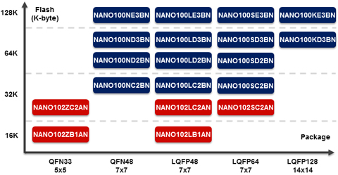

# [Nano100](https://github.com/sochub/Nano100) 
 
####  qitas@qitas.cn
#### 父级：[nuvoton](https://github.com/sochub/nuvoton)
#### 归属：[Cortex-M0](https://github.com/sochub/CM0) 
### [芯片简介](https://github.com/sochub/Nano100/wiki)

NuMicro™ Nano100 系列特色为超低功耗，低电压工作范围1.8V至3.6V，工作温度：-40℃至85℃，内建12MHz高精度晶振(1%准确度)。

备有丰富的外设，如定时器、看门狗定时器、RTC、PDMA、UART、SPI、I²C、I²S、PWM、12位ADC、12位DAC、ISO-7816等。

提供多种包装QFN48、LQFP48、LQFP64、LQFP128。 

 

### [收录资源](https://github.com/sochub/Nano100)

* [参考文档](docs/)
* [参考资源](src/)
* [模板工程](demo/)
* [编译工具](https://github.com/sochub/arm-none-eabi)

### [替换方案](https://github.com/sochub/Nano100)

* 向下替换方案 [N76E003](https://github.com/sochub/N76E003) 
* 同级替换方案 [STM32F0](https://github.com/sochub/STM32F0) 
* 向上替换方案 [M480系列](https://github.com/sochub/M480) 

##  [SoC资源平台](http://www.qitas.cn)

